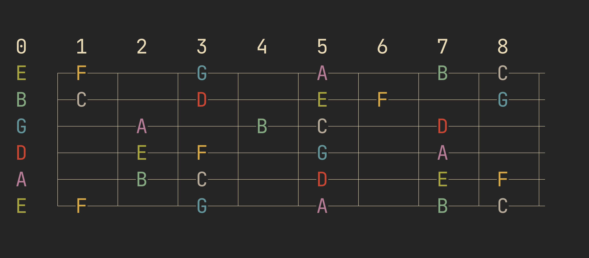
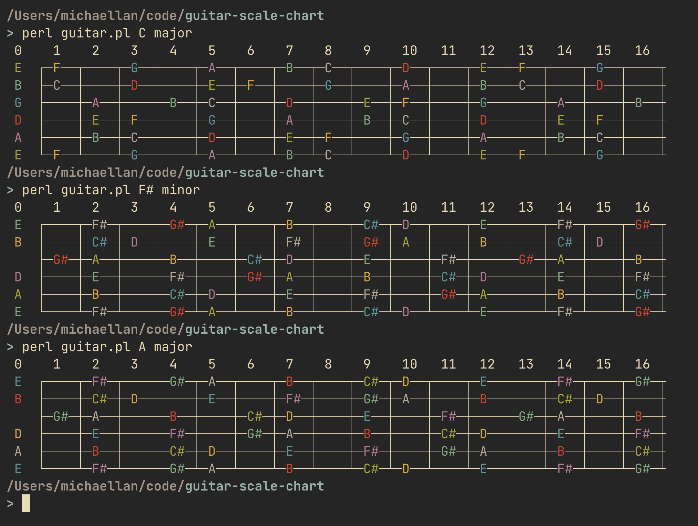

# guitar-scale-chart

A script to display guitar scales across the fretboard. I made this
to practice my guitar improvisation, and I hope others find it
useful.

**Note:** Requires `Term::ANSIColor` and `List::MoreUtils`

## Example usages:



```
perl guitar.pl Db major
```

```
perl guitar.pl A minor
```

```
perl guitar.pl C# minor
```

## Additional script modification

You can edit `$num_frets` to change the number of shown frets.

You can also change `@color_config` to use different colors for the
different degrees of the scale.

## Alternatives

You can use  but it's not as cool :thinking_face:
